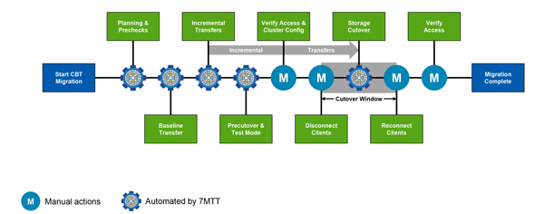

= データと構成のマイグレーションプロセス
:icons: font
:imagesdir: ../media/

[role="lead"]
7-Mode Transition Tool を使用したデータと構成のマイグレーションプロセスは、準備、ベースラインデータコピー、構成の適用（カットオーバー前）、ストレージカットオーバーの各フェーズで構成されます。CoC 検証の対象となる SnapLock ボリュームがある場合は、カットオーバー後に CoC 検証フェーズが追加されます。

次の図は、マイグレーションプロセスの各フェーズを示しています。

== 準備

このフェーズでは、事前確認が実行されて、機能が検証されます。7-Mode ストレージシステムがチェックされて、ボリュームと構成を ONTAP にマイグレートする準備ができているかどうかが検証されます。また、クラスタが正しく設定されて移行をサポートできる状態にあるかが確認されます。移行を続行する前に、すべてのエラーを解決しておく必要があります。警告を解決しなくても移行は続行できますが、続行する前に警告の影響を理解しておく必要があります。事前確認を複数回実行して、すべてのエラーが解決されたことを確認することができます。

事前確認手順と評価時に実行される評価手順は似ていますが、いくつかの違いがあります。事前確認手順は、マイグレーションのソースシステム（ 7-Mode ）およびデスティネーションシステム（ ONTAP ）に指定された特定のストレージシステムを対象とした、より詳細なテストです。評価手順で評価されるのはマイグレーションのソースシステムのみで、 ONTAP との機能の違いがチェックされます。

== ベースラインデータコピー

SVM に新しいボリュームが作成され、 7-Mode ボリュームと ONTAP ボリュームの間に SnapMirror 関係が確立され、ベースライン転送が実行されます。ベースライン転送が完了すると、ユーザが定義したデータコピースケジュールに従って自動的に差分転送が実行されます。この手順を完了しても、ソースストレージにアクセスするクライアントとサーバはオンラインのままです。

データのコピーには CPU 、メモリ、およびストレージアクセスが必要であるため、ソースストレージシステムで追加のリソースが使用されることになります。データコピー処理は、オフピークの時間帯に実行されるようにスケジュールするのがベストプラクティスです（ CPU 利用率が 50% 前後の時間帯を推奨）。

== 構成の適用（カットオーバー前）

このフェーズでは SnapMirror の差分転送が行われ、 ONTAP のシステム、 SVM 、およびボリュームに設定情報が適用されます。オプションで、ストレージカットオーバーの前に移行先の ONTAP ボリュームをテストすることもできます。

構成の大部分が適用されますが、クォータの適用など、一部の操作はストレージカットオーバーに保留されます。

移行対象として選択した 7-Mode IP アドレスが、管理状態が down で作成されます。移行対象として選択した新しい IP アドレスが管理状態が up で作成されます。これらの新しい IP アドレスは、カットオーバー前のテスト時にデータアクセスの検証に使用できます。

計画したカットオーバー期間の数日 ~ 数週間前に構成の適用（カットオーバー前）を実行することを推奨します。この処理により、すべての構成が適切に適用されるかどうか、何らかの変更が必要かどうかを確実に検証できます。

TIP: 差分更新は必須ではありませんが、クライアントが切断される時間を最小限に抑えるために、できるだけストレージカットオーバーに近いタイミングで差分転送を実行するのがベストプラクティスです。

== ストレージカットオーバー

ストレージカットオーバーでは、クライアントが切断され、最終データ転送が実行され、 SnapMirror 関係が解除され、クライアントが手動で再接続されます。

クライアントまたはサーバがソースストレージボリュームから切断されるため、最終コピーが実行されている間に追加の書き込みが行われることはありません。クライアントを切断する前に、差分更新を実行してダウンタイムを最小限に抑えるのがベストプラクティスです。

ストレージアクセスを切断するのは、マイグレート中のボリュームのみにする必要があります。ストレージへのアクセスは、ストレージ側またはクライアント側から切断できます。ストレージ側から切断することを推奨します。たとえば、 CIFS クライアントから 7-Mode ストレージシステム上の「 user01 」という名前のボリュームにアクセスしている場合は、「 cifs terminate -v user01 」コマンドを使用して、ボリューム上のすべての CIFS 共有へのアクセスを無効にする（ストレージ側からクライアントアクセスを切断する）ことができます。移行によって IP アドレス、マウントポイント、または共有名が変更される場合があり、そのためクライアント側からもクライアントアクセスが切断される可能性があります。マイグレート対象のストレージコンテナにクライアントが新しいデータを書き込めさえしなければ、どちらの方法でアクセスを切断してもかまいません。

クライアントが切断されると、 7-Mode Transition Tool によって最終コピーが実行されて、ソースとデスティネーションのデータセットが同一になります。また、 SVM 上でデータ LIF が設定されます。カットオーバー前フェーズで移行されなかった構成の変更（ SAN 構成とクォータの適用など）は、この時点で SVM にも適用されます。

ストレージカットオーバーが完了したら、クライアントを手動で再接続してデータアクセスを検証します。データアクセスの検証では、クライアントが ONTAP システムに正常にアクセスしていること、およびすべての権限が想定どおりに機能していることを確認します。

== SnapLock ボリュームの CoC 検証

移行が完了したら、プロジェクト内の SnapLock ボリュームに対して CoC 処理を開始できます。この処理は必須ではなく、 SnapLock ボリュームの移行に CoC 検証が不可欠な場合にのみ必要となります。この処理は、プロジェクト内のすべての SnapLock 、またはプロジェクト内の一部の SnapLock に対して実行できます。CoC 検証は、 SnapLock ボリュームと Volume の両方でサポートされます。CoC 検証は読み書き可能な SnapLock ボリュームでのみサポートされ、読み取り専用の SnapLock ボリュームではサポートされません。

IMPORTANT: また、名前に非 ASCII 文字を含むファイルが格納されている SnapLock ボリュームでもサポートされません。

検証ワークフローは 7-Mode Transition Tool の GUI でのみサポートされ、 CLI ワークフローではサポートされません。

CoC 検証では次の処理が実行されます。

* 7-Mode ボリュームの WORM ファイルをすべて列挙します
* 列挙した各 WORM ファイルについて、フィンガープリントを計算します 7-Mode ボリュームと移行した ONTAP ボリュームの両方
* フィンガープリントが一致するファイルと一致しないファイルの数、および不一致の理由を記載したレポートを作成します

すべての WORM ファイルのフィンガープリントデータは、計画フェーズで指定した ONTAP ボリュームに格納されます。

NOTE: 7-Mode ボリュームのファイル数によっては、 CoC 検証プロセスにかなりの時間（数日 ~ 数週間）がかかることがあります。
