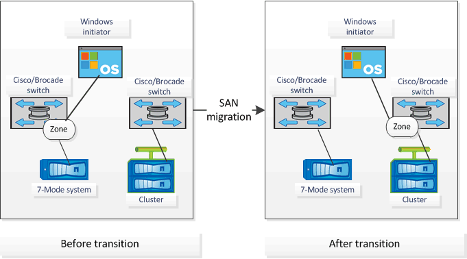

= FC ゾーン計画の生成でサポートされる構成
:allow-uri-read: 
:icons: font
:imagesdir: ../media/

[role="lead"]
FC ゾーン計画の生成でサポートされる 7-Mode システム、ホスト、 FC スイッチ、およびクラスタの構成を理解しておく必要があります。移行後のクラスタのゾーンの設定には、この計画を使用する必要があります。

データセンターの要件に応じて、 7-Mode システム（シングルコントローラまたは HA ペア）、ホスト、およびクラスタは同じファブリック内または異なるファブリックのスイッチに接続できます。

次の図は、 7-Mode システム、ホスト、およびクラスタを同じファブリック内のスイッチに接続した場合の構成を示しています。

image::../media/fc_zone_config1.gif[次の図は、 7-Mode を使用した構成を示しています システム,hosts,and cluster are connected to the switches in the same fabric]

次の図は、 7-Mode システムとクラスタを異なるファブリックのスイッチに接続した場合の構成を示しています。

