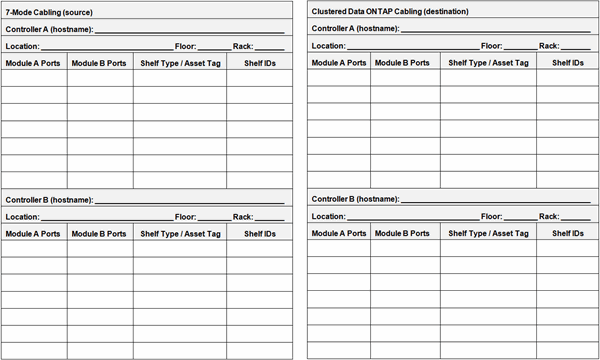

= コピーフリーの移行ケーブル接続ワークシート
:allow-uri-read: 
:icons: font
:imagesdir: ../media/

[role="lead"]
Copy-Free Transition ケーブル接続ワークシートを使用して、ケーブル接続を計画できます。7-Mode コントローラとターゲットクラスタノードに接続するポートとディスクシェルフの情報を記録する必要があります。また、 7-Mode ディスクシェルフをターゲットクラスタノードに接続する際に使用するポートも記録しておく必要があります。

* モジュール A/B ポート：モジュール A/B のポート接続
* シェルフタイプ / 資産タグ：ディスクシェルフタイプ
* Shelf ID ：ディスクシェルフ ID

== ケーブル接続ワークシートの例

|===
4+| 7-Mode のケーブル接続 4+| clustered Data ONTAP のケーブル配線 

4+| コントローラ A （ホスト名）： 7hostA 4+| ノード A （ホスト名）： cluster1-01 

4+| 場所：コロラド、フロア： 3 階、ラック： 8 4+| 場所：コロラド、フロア： 5 階、ラック： 3 

| モジュール A のポート | モジュール B のポート | シェルフタイプ / 資産タグ | シェルフ ID | モジュール A のポート | モジュール B のポート | シェルフタイプ / 資産タグ | シェルフ ID 

 a| 
1A
 a| 
0a
 a| 
DS4244/150254-7
 a| 
10 ～ 13
 a| 
1A
 a| 
0a
 a| 
DS4243 / 174243-2
 a| 
10-11

 a| 
1B
 a| 
0 億
 a| 
DS4243 / 151205-2
 a| 
30 ～ 37
 a| 
1B
 a| 
0 億
 a| 
DS4244/150254-7
 a| 
20-23

 a| 
1c （オフライン）
 a| 
0c （オフライン）
 a| 
該当なし
 a| 
該当なし
 a| 
1C
 a| 
0c
 a| 
DS4243 / 151205-2
 a| 
30 ～ 37

 a| 
1D
 a| 
0d
 a| 
DS4243 / 143921-4
 a| 
14-15
 a| 
1D
 a| 
0d
 a| 
DS4243 / 143921-4
 a| 
14-15

 a| 
* コントローラ B （ホスト名）： 7hostB *
 a| 
* ノード B （ホスト名）： cluster1-02 *

 a| 
* 場所：コロラド、フロア： 3 階、ラック： 8 *
 a| 
* 場所：コロラド、フロア： 5 階、ラック： 3 *

 a| 
* モジュール A ポート *
 a| 
* モジュール B ポート *
 a| 
* シェルフタイプ / 資産タグ *
 a| 
* シェルフ ID *
 a| 
* モジュール A ポート *
 a| 
* モジュール B ポート *
 a| 
* シェルフタイプ / 資産タグ *
 a| 
* シェルフ ID *

 a| 
1A
 a| 
0a
 a| 
DS4243 / 174263-6
 a| 
10 ～ 13
 a| 
1A
 a| 
0a
 a| 
DS4243 / 174233-2
 a| 
10-11

 a| 
1b （オフライン）
 a| 
0b （オフライン）
 a| 
該当なし
 a| 
該当なし
 a| 
1B
 a| 
0 億
 a| 
DS4243 / 174263-6
 a| 
20-23

 a| 
1C
 a| 
0c
 a| 
DS4243 / 174274-9
 a| 
30 ～ 37
 a| 
1C
 a| 
0c
 a| 
DS4243 / 174274-9
 a| 
30 ～ 37

 a| 
1D
 a| 
0d
 a| 
DS4243 / 174285-6
 a| 
14-15
 a| 
1D
 a| 
0d
 a| 
DS4243 / 174285-6
 a| 
14-15

|===